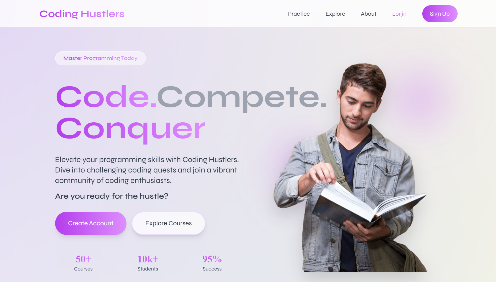

# 🚀 Coding Hustlers

<div align="center">
  

  ### Code. Compete. Conquer. 💻

  **The ultimate platform for mastering programming through interactive courses, AI-powered tests, and real-world coding challenges.**

  [](https://www.typescriptlang.org/)
  [](https://reactjs.org/)
  [](https://vitejs.dev/)
  [](https://firebase.google.com/)
  [](https://tailwindcss.com/)

</div>

---

## 📖 Table of Contents

- [✨ Features](#-features)
- [🛠️ Tech Stack](#️-tech-stack)
- [🚀 Getting Started](#-getting-started)
  - [Prerequisites](#prerequisites)
  - [Installation](#installation)
  - [Environment Setup](#environment-setup)
  - [Running the Project](#running-the-project)
- [📁 Project Structure](#-project-structure)
- [🔥 Key Features Breakdown](#-key-features-breakdown)
- [🎯 Usage Guide](#-usage-guide)
- [🤝 Contributing](#-contributing)
- [📄 License](#-license)
- [👨‍💻 Author](#-author)

---

## ✨ Features

### 🎓 **Comprehensive Learning Platform**
- 📚 **Interactive Courses**: Structured learning paths with chapters and lessons
- 🧠 **AI-Powered Content**: Dynamic course generation using Google Gemini AI
- 📊 **Progress Tracking**: Monitor your learning journey with detailed analytics
- 🏆 **Achievement System**: Earn badges and track milestones

### 💯 **Advanced Testing System**
- ✅ **MCQ Tests**: Multiple-choice questions to test your knowledge
- 💻 **Coding Challenges**: Real-world programming problems with instant feedback
- ⏱️ **Timed Assessments**: Practice under time constraints
- 📈 **Performance Analytics**: Detailed insights into your test results

### 🔐 **Secure Authentication**
- 🔒 **Firebase Authentication**: Industry-standard security
- 👤 **User Profiles**: Personalized dashboard and settings
- 🎨 **Profile Customization**: Avatar, bio, and social links

### 🎨 **Modern UI/UX**
- 🌙 **Beautiful Design**: Clean, modern interface with smooth animations
- 📱 **Fully Responsive**: Optimized for desktop, tablet, and mobile
- ⚡ **Lightning Fast**: Built with Vite for optimal performance
- 🎭 **Intuitive Navigation**: Seamless user experience

---

## 🛠️ Tech Stack

### **Frontend**
| Technology | Description |
|------------|-------------|
|  | UI library for building interactive interfaces |
|  | Type-safe JavaScript for robust code |
|  | Next-generation frontend tooling |
|  | Utility-first CSS framework |
|  | Client-side routing |

### **Backend & Services**
| Technology | Description |
|------------|-------------|
|  | Authentication & Firestore database |
|  | AI-powered content generation |

### **Development Tools**
| Technology | Description |
|------------|-------------|
|  | Code linting and quality |
|  | CSS transformations |
|  | Beautiful icon library |

---

## 🚀 Getting Started

### Prerequisites

Before you begin, ensure you have the following installed:

- **Node.js** (v18 or higher) - [Download](https://nodejs.org/)
- **npm** (v9 or higher) - Comes with Node.js
- **Git** - [Download](https://git-scm.com/)

### Installation

1. **Clone the repository**

```bash
git clone https://github.com/panduthegang/Coding-Hustlers.git
cd Coding-Hustlers
```

2. **Install dependencies**

```bash
npm install
```

### Environment Setup

Create a `.env` file in the root directory with the following variables:

```env
# Firebase Configuration
VITE_FIREBASE_API_KEY=your_firebase_api_key
VITE_FIREBASE_AUTH_DOMAIN=your_firebase_auth_domain
VITE_FIREBASE_PROJECT_ID=your_firebase_project_id
VITE_FIREBASE_STORAGE_BUCKET=your_firebase_storage_bucket
VITE_FIREBASE_MESSAGING_SENDER_ID=your_firebase_messaging_sender_id
VITE_FIREBASE_APP_ID=your_firebase_app_id


# Google Gemini AI
VITE_GEMINI_API_KEY=your_gemini_api_key
```

#### 🔑 Getting API Keys

1. **Firebase**:
   - Go to [Firebase Console](https://console.firebase.google.com/)
   - Create a new project or select existing
   - Navigate to Project Settings → General → Your apps
   - Copy the configuration values

2. **Google Gemini AI**:
   - Go to [Google AI Studio](https://makersuite.google.com/app/apikey)
   - Create an API key
   - Copy the key

### Running the Project

#### Development Mode

```bash
npm run dev
```

The application will start at `http://localhost:5173`

#### Build for Production

```bash
npm run build
```

#### Preview Production Build

```bash
npm run preview
```

#### Lint Code

```bash
npm run lint
```

#### Type Check

```bash
npm run typecheck
```

---

## 📁 Project Structure

```
Coding-Hustlers/
├── public/                      # Static assets
│   ├── logo.svg                # App logo
│   ├── hero-person.png         # Hero section image
│   ├── coding-illustration.png # Coding section image
│   └── community-illustration.png # Community section image
├── src/
│   ├── components/             # Reusable components
│   │   ├── Header.tsx         # Navigation header
│   │   ├── Footer.tsx         # Footer component
│   │   ├── Sidebar.tsx        # Dashboard sidebar
│   │   ├── HeroSection.tsx    # Landing hero section
│   │   ├── ChapterOverview.tsx # Course chapter display
│   │   ├── CommunitySection.tsx # Community features
│   │   ├── CompaniesSection.tsx # Partner companies
│   │   └── ProtectedRoute.tsx  # Auth route guard
│   ├── contexts/              # React contexts
│   │   └── AuthContext.tsx    # Authentication context
│   ├── pages/                 # Page components
│   │   ├── Landing.tsx        # Landing page
│   │   ├── Login.tsx          # Login page
│   │   ├── SignUp.tsx         # Sign up page
│   │   ├── Dashboard.tsx      # User dashboard
│   │   ├── Courses.tsx        # Courses listing
│   │   ├── CourseDetail.tsx   # Course detail page
│   │   ├── ChapterTest.tsx    # Chapter tests
│   │   ├── Tests.tsx          # Tests overview
│   │   ├── MCQTest.tsx        # MCQ test page
│   │   ├── CodingTest.tsx     # Coding challenge page
│   │   ├── Profile.tsx        # User profile
│   │   ├── Settings.tsx       # User settings
│   │   └── About.tsx          # About page
│   ├── lib/                   # Utility libraries
│   │   ├── courseData.ts      # Course data management
│   │   ├── courseStorage.ts   # Course persistence
│   │   ├── gemini.ts          # AI integration
│   │   └── localStorage.ts    # Local storage utilities
│   ├── services/              # API services
│   │   └── firestore.ts       # Firestore operations
│   ├── types/                 # TypeScript types
│   │   ├── course.ts          # Course type definitions
│   │   └── profile.ts         # Profile type definitions
│   ├── config/                # Configuration files
│   │   └── firebase.ts        # Firebase configuration
│   ├── App.tsx                # Main app component
│   ├── main.tsx               # App entry point
│   └── index.css              # Global styles
├── .env                       # Environment variables
├── index.html                 # HTML template
├── package.json               # Dependencies
├── tsconfig.json              # TypeScript config
├── tailwind.config.js         # Tailwind config
├── vite.config.ts             # Vite config
├── firestore.rules            # Firestore security rules
├── firestore.indexes.json     # Firestore indexes
└── README.md                  # Project documentation
```

---

## 🔥 Key Features Breakdown

### 1. 🎓 **Course System**

The platform offers a comprehensive course management system:

- **Dynamic Course Creation**: AI-powered course generation
- **Chapter-Based Learning**: Structured content divided into manageable chapters
- **Progress Tracking**: Automatic saving of course progress
- **Multiple Formats**: Support for video, text, and interactive content

### 2. 💯 **Testing & Assessment**

Two types of tests to evaluate your skills:

#### **MCQ Tests**
- Multiple-choice questions with instant feedback
- Topic-based categorization
- Timed challenges
- Score tracking and analytics

#### **Coding Challenges**
- Real programming problems
- Multiple difficulty levels
- Code execution and validation
- Performance metrics

### 3. 👤 **User Management**

- **Authentication**: Secure login/signup with Firebase
- **Profile Management**: Customizable user profiles
- **Settings**: Personalize your experience
- **Dashboard**: Centralized view of your progress

### 4. 🎨 **UI/UX Excellence**

- **Responsive Design**: Works on all devices
- **Modern Aesthetics**: Clean and professional interface
- **Smooth Animations**: Delightful user interactions
- **Accessibility**: Built with accessibility in mind

---

## 🎯 Usage Guide

### For Learners

1. **Sign Up**: Create your account to get started
2. **Browse Courses**: Explore available courses on the Courses page
3. **Start Learning**: Enroll in courses and complete chapters
4. **Take Tests**: Challenge yourself with MCQ and coding tests
5. **Track Progress**: Monitor your achievements on the Dashboard

### For Developers

1. **Fork the Repository**: Create your own copy
2. **Set Up Environment**: Configure your API keys
3. **Make Changes**: Implement your features
4. **Test Thoroughly**: Ensure everything works
5. **Submit PR**: Contribute back to the community

---

## 🤝 Contributing

We welcome contributions from the community! Here's how you can help:

### Steps to Contribute

1. **Fork the repository**
2. **Create a feature branch**
   ```bash
   git checkout -b feature/amazing-feature
   ```
3. **Commit your changes**
   ```bash
   git commit -m 'Add some amazing feature'
   ```
4. **Push to the branch**
   ```bash
   git push origin feature/amazing-feature
   ```
5. **Open a Pull Request**

### Contribution Guidelines

- Follow the existing code style
- Write clear commit messages
- Add tests for new features
- Update documentation as needed
- Be respectful and constructive

---

## 📄 License

This project is licensed under the MIT License - see the [LICENSE](LICENSE) file for details.

---

## 👨‍💻 Author

**Pandu the Gang**

- GitHub: [@panduthegang](https://github.com/panduthegang)
- Repository: [Coding Hustlers](https://github.com/panduthegang/Coding-Hustlers)

---

<div align="center">

### 🌟 Star this repository if you find it helpful!

**Made with ❤️ by developers, for developers**

[](https://github.com/panduthegang/Coding-Hustlers/stargazers)
[](https://github.com/panduthegang/Coding-Hustlers/network/members)

---

### 📬 Questions or Suggestions?

Feel free to [open an issue](https://github.com/panduthegang/Coding-Hustlers/issues) or reach out!

**Happy Coding! 🚀**

</div>
